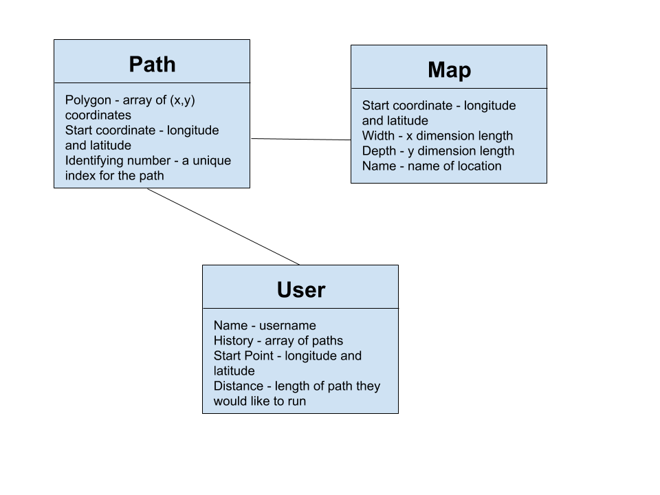
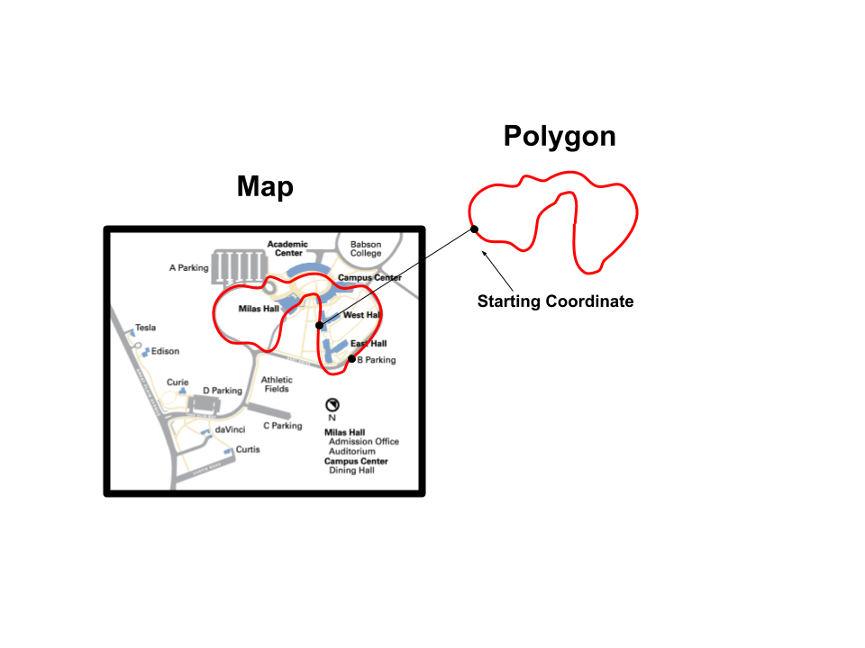

# Project Description:

We intend to create a program that visualizes exercise data and suggests new routes for the future. In our program, a user will be able to input data through a GPS enabled device to track their runs. We will also build a database of routes by scraping websites like Strava and compiling those routes into maps. Our algorithm will then use that data to suggest new routes that are a user's specified length.

# Background Information:

* Good Routes - Our team has defined a good route as a non-overlapping path that starts and stops at the same point and is unlike the last route taken by a given user.
* OpenStreetMap - OpenStreetMap contains a plethora of open source map data, and we will use it to help construct our map visual and potentially to determine viable routes. We will likely overlay the routes we come up with on OpenStreetMap.
* GMPlot - As an alternative to OpenStreetMap, we have considered using Google Maps Plot to display our data on top of a map of that area. This will help us verify if our new route suggestion is suggesting valid paths. If we have extra time, we may do something else and create a novel way to visualize our data.
* Strava - To create a database of existing running paths, we will collect data from Strava. This will likely involve a fair bit of scraping once we have accessed all of the data available through the Strava API. (Stava is a popular app where users upload and share their GPS tracked, running and cycling activities.)

# Key Questions:

* How can we use machine learning? What can we use machine learning for in this kind of program?
* What information do runners want?
* What else makes a good route?
* How could we best visualize this data? Any suggestions/opinions between OpenStreetMap and GMPlot?

# Agenda:

* Introduce topic (2 min)
* Give background information (2 min)
* Ask the audience for questions (5 min)
* Ask our questions(5 min)

# Google Form

Google Form [here](https://goo.gl/forms/dkYFP9qiG7RTSUcu2)

Additional link: https://goo.gl/forms/dkYFP9qiG7RTSUcu2
