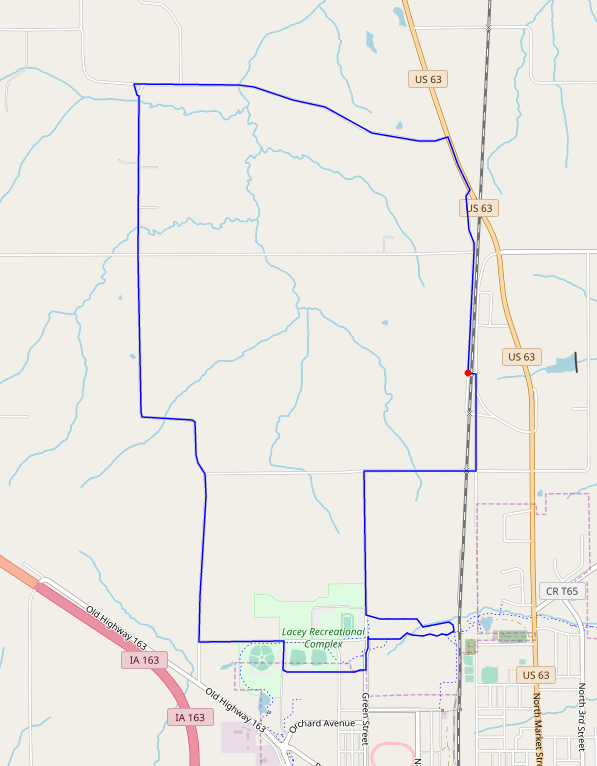
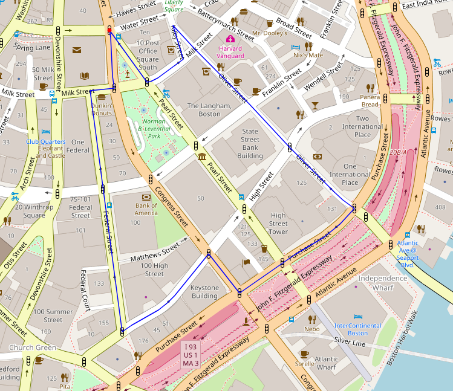

# Implementation
Trail Blazer has several key components, all of which are integrated into the GUI design. To begin, our GUI handles the interactions between the users and the programs and additionally controls how all of the visuals are ultimately displayed. When the GUI sends a request for a new route, the route-finding portion of Trail Blazer, which relies heavily on its Graph and Edge classes, comes into play. At the same time, the GUI queries for and displays elevation and weather data.

Below is a class diagram of Trail Blazer in its current state:

### Performance
Trail Blazer's performance is rather intimately tied to the size of the graph it creates. In other words, the performance of Trail Blazer changes greatly depending on the geographic area in which you utilize it. For instance, in an area of southeastern Iowa with few roads and intersections, the depth-first algorithm Trail Blazer employs easily queries for and plots routes of up to 15 kilometers.

In contrast, in denser areas such as cities like Boston, Trail Blazer has difficulty locating cycles in the graph that are longer than 3 kilometers.

#### Potential Solutions
1. Attempt a breadth-first search for cycles in the graph. Though the team behind Trail Blazer attempted to implement such an algorithm, they were ultimately unable to complete such an implementation and chose to stick with a depth-first search instead.
2. Provide the algorithm with an increased number of checkpoints. Rather than simply allowing the search to traverse as deep as possible up until the path reaches the desired length, at which point it has either found a cycle or traversed too deeply, we could instead calculate the straight line distance between the starting point and any given node. In this scenario, we could tell the algorithm that it has traversed too deeply if the straight line distance between the start node and the current node it is traversing is greater than half of the desired path length.
3. Similarly, we could break the graph up into smaller graphs. Rather than checking every node in a given area, the algorithm could construct larger edges that are composed of several smaller edges. Depending on the number of original edges in each multi-edge, the graph could be simplified greatly to include only a small fraction of the original number of nodes. As a result, denser geographic areas like cities could be treated in the same way as more sparsely populated areas.
