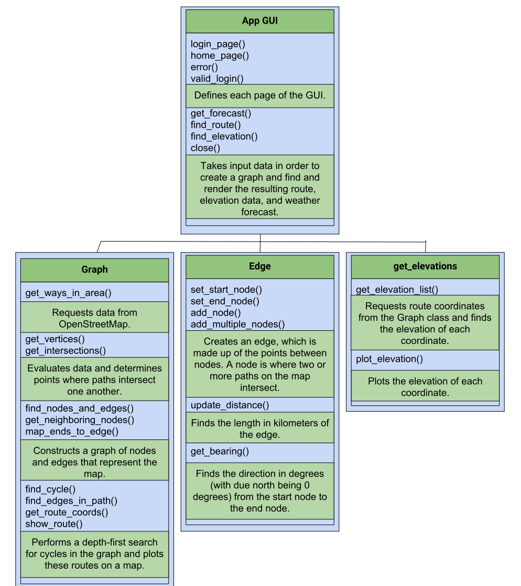

# Implementation
Trail Blazer has several key components, all of which are integrated into the GUI design. To begin, our GUI handles the interactions between the users and the programs and additionally controls how all of the visuals are ultimately displayed. When the GUI sends a request for a new route, the route-finding portion of Trail Blazer, which relies heavily on its Graph and Edge classes, comes into play. At the same time, the GUI queries for and displays elevation and weather data based on several other scripts.

