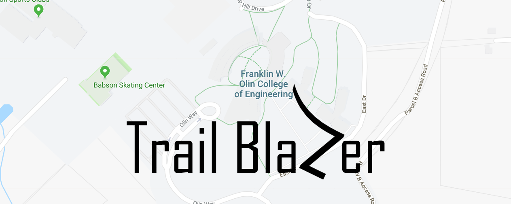
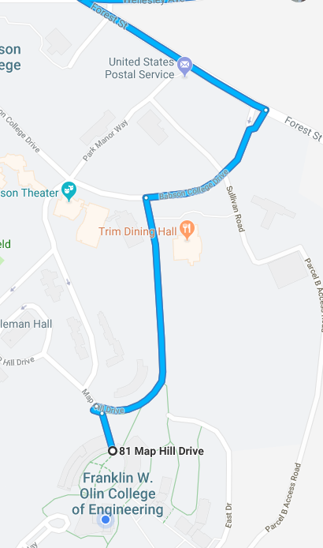
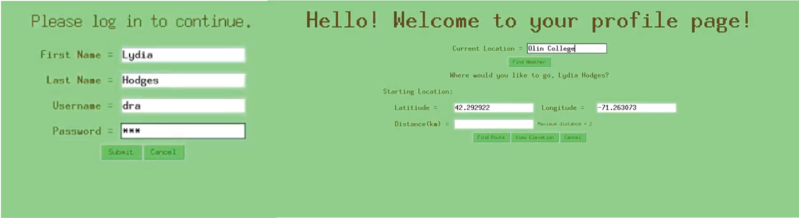
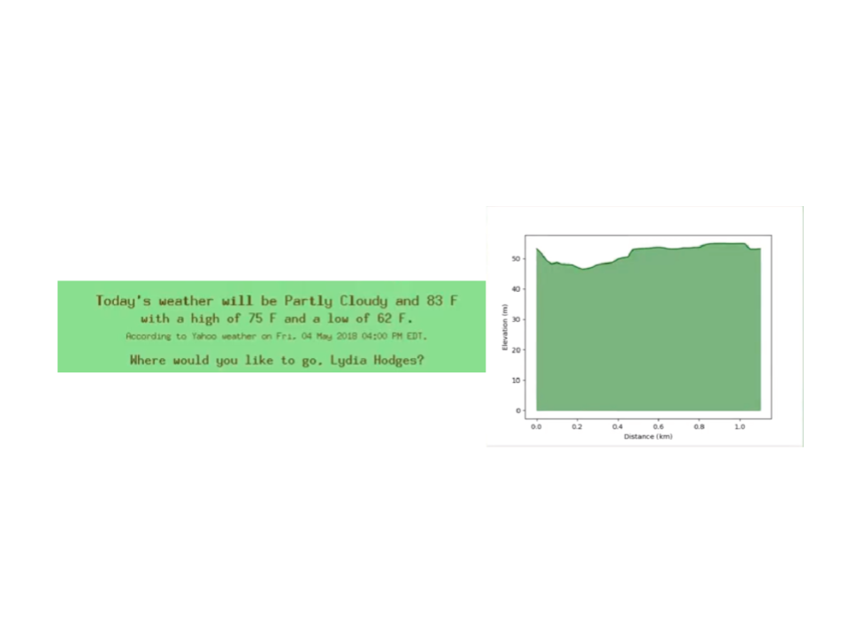

# A Route Suggestion Tool

### By Daniel Connolly, Raquel Dunoff, and Lydia Hodges

## What is it?
Trail Blazer is a route suggestion GUI that helps people on foot find new routes that never take them through the same location twice. Though some prefer to take the most efficient possible paths to every destination in life, Trail Blazer arose out of a deep-seeded desire for exploration. The team behind the GUI have worked tirelessly to help quench the thirst of those that, like the team itself, make an effort to find new paths at every opportunity. Never wanting to return home via the same path taken to reach the outbound destination, the team came up with the idea for a resource that helps evoke the explorer within us by suggesting running, walking, or biking routes that satisfy the distance and location specifications of users without ever routing you through the same point twice. This goal -- to help people more fully realize the adventurer within themselves -- underlies every aspect of the GUI and every line of code that contributed to producing it.

## Features
Trail Blazer allows a user to provide a starting location and a desired distance before it finds and displays a nonoverlapping route that meets the user's criteria on a map. In the broadest sense, Trail Blazer queries for map data in an area surrounding the geographic point provided by the user and then constructs a graph that represents the important aspects of the map. It then performs a recursive depth-first search for cycles in the graph, which are then displayed on a map as a route. To see it work for yourself, follow the instructions found [here](run.md). Furthermore, the team behind Trail Blazer has recently recognized the value of incorporating additional data regarding conditions into the GUI. For instance, it can currently find and display weather and elevation data about each route that the program generates.

## A Meandering Path
For the team behind Trail Blazer, the path from idea to reality was all but straight and the final product belies the deep understanding of new subject matter that was required to produce it. 

#### A Brief Foray into Google Maps APIs
Starting with only a general sense of direction and a bit of excitement, the team quickly set out to determine the best way to implement its ideas. Though the team agreed that using data from open source projects like OpenStreetMap would be preferable, some initial troubles shifted the project in favor of interacting with the Google Maps API. Nevertheless, the team created what could now be referred to as a proof-of-concept -- a web app that used user input regarding distance to generate a one way route from any point to another point that was the given distance away as-the-crow-flies in a randomized direction.

#### The Transition
Realizing both the limitations of the Google Maps API and the fact that this strategy achieved very few of the team's learning goals, the team chose to pivot. The first step, then, was to confront the issues the team had faced with regards to OpenStreetMap and learn to query for and utilize the open source mapping data. Next, the team needed to utilize that data in order to create a graphical representation of a map. With the data finally available, the team expected this to be a simple task; to their surprise, building a suitable representation required the team to learn far more graph theory than anyone that looks through the source code will ever realize. Moreover, facing deadlines and a desire to create a working product of some sort, Trail Blazer briefly utilized NetworkX in order to find the cycle bases in the graph it had created. This minimum viable version of Trail Blazer, however, was quickly discarded in favor of writing more original cycle-finding algorithms. Today, this more unique version of the Trail Blazer, with a few modifications, lives on in its GUI.

#### The GUI
Like most aspects of Trail Blazer, the team did not set out expecting to make a GUI. In fact, the team first created a rather basic web app to utilize during the earlier proof-of-concept stages of the project. Despite the fact that Trail Blazer is a product perhaps better suited for a web app than a GUI, the team found that creating a GUI would most adequately align with their learning goals. As a result, the team has painstakingly worked to incorporate more modern maps and web features with the rather out-of-date GUI toolkit that is tkinter. The biggest bump in the road has been tkinter's lack of support for working with html or javascript and limited support for image files. Due to these limitations, the team had to make a compromise -- instead of viewing the route and elevation displays within the GUI, each is opened as an html page in a browser and a stand-alone figure, respectively. To the people behind Trail Blazer, this unqiue blend of less-than-modern GUI with modern open source map data sets it apart as a route suggestion tool.

#### Additional Features
In order to create the best product for our customer, we asked our stakeholders questions about what information they would like to have before they go for a run. We then parsed their responses and turned it into features of our app like displaying the weather and plotting the elevation throughout the path. Adding these components help to create the best experience for our users. 

