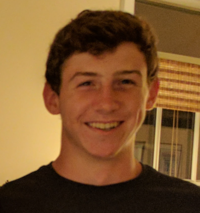
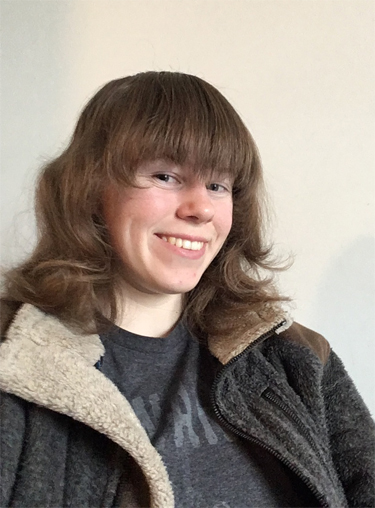
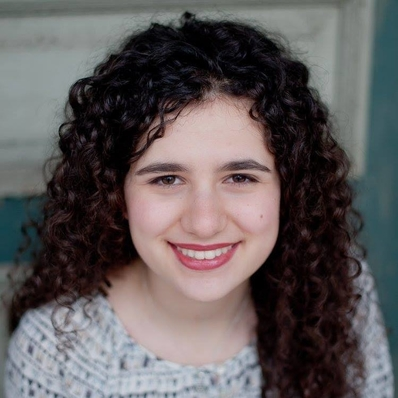

# The Team

### Daniel Connolly

Daniel is a first year student in Electrical and Computer Engineering at Olin College of Engineering. He is an avid outdoorsman that takes advantage of every opportunity to get outside and to learn new skills. His interests in this regard include running, travelling, hiking, pole vaulting, ultimate frisbee, sailing, and general adventuring.

### Lydia Hodges

Lydia is a first year student in Bio Engineering at Olin College of Engineering.

### Raquel Dunoff

Raquel is a first year student in Engineering with a concentration in Design at Olin College of Engineering. She is also interseted in community building and entrepreneurship and plans to start her own start up this summer. 
